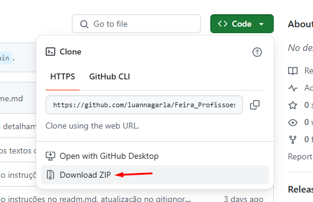

# 🤖 Projeto de IA - Feira de Profissões 2025 

Este projeto contém notebooks Jupyter para tarefas de Inteligência Artificial, como detecção e estilização de rosto em tempo real.

### 🎨 Sobre o RIA - A IA Retratista
A RIA é uma IA especializada em gerar retratos do rosto dos modelos que autorizam a produção. Contudo, a RIA é uma artista incompreendida (nem mesmo ela se compreende) e não salva as artes que produz, por que julga não estarem perfeitas.


#### Opções de Estilo para o Retrato:

- Lápis de cor
- Tinta à base de água
- Tinta óleo

### 🫥 Sobre o Detector de Rostos

Este módulo captura vídeo da webcam, detecta rostos em tempo real e os destaca no quadro. Ele serve como base para funcionalidades como as da RIA e pode ser utilizado para outras aplicações de visão computacional.

# 🧪 Como testar

## 📁 Requisitos

- [Python 3.11 instalado ](https://www.python.org/downloads/release/python-3110/)
- Câmera (os notebooks utilizam captura de imagem em tempo real)


## 🚀 Preparação 
Faça o download dos códigos e extraia o conteúdo do .zip (de preferência na pasta Downloads para facilitar o acesso).



## ⚙️ Configuração do Ambiente

### 1️⃣ Criar o ambiente virtual

#### Windows
Abra o terminal cmd (ou PowerShell) como Administrador

Navegue até a pasta que você descompactou (no exemplo abaixo os códigos estão em Downloads):

```PowerShell
cd Downloads/Feira_Profissoes_2025-main/Feira_Profissoes_2025-main
```

Crie o ambiente virtual:
```PowerShell
py -3.11 -m venv venv # versão especificada
```

#### Linux/Mac
Abra o terminal, navegue até a pasta que você descompactou (no exemplo abaixo os códigos estão em Downloads):

```Bash
cd ~/Downloads/Feira_Profissoes_2025-main/Feira_Profissoes_2025-main
```

Crie o ambiente virtual:
```Bash
python3.11 -m venv venv # versão especificada
```

### 2️⃣ Ativar o ambiente virtual
Ative o ambiente de acordo com o seu sistema operacional:

#### Windows
```PowerShell
venv\Scripts\Activate.ps1
```
⚠️ Se aparecer erro de permissão, execute o PowerShell como Administrador e rode:

```Set-ExecutionPolicy -ExecutionPolicy RemoteSigned -Scope CurrentUser```

Depois tente ativar de novo com:
```PowerShell
venv\Scripts\Activate.ps1
```

#### Linux/Mac
```bash
source venv/bin/activate
```

Você saberá que o ambiente está ativado quando o nome dele aparecer à esquerda no terminal, como por exemplo:

```(venv) PS C:\Local-do-Arquiro\Feira_Profissoes_2025> ```

### 3️⃣ Instalar as dependências
Com o ambiente ativado, instale os pacotes necessários:

```
pip install -r requirements.txt
```

Se você estiver utilizando MacOs, rode também:

```
pip install -r requirements-mac.txt
```

A saída esperada após a execução é semelhante a:


## 📓 Executando os notebooks

⚠️ Se ocorrer erros nessa etapa, certifique-se de atender aos requisitos mínimos 
- Python 3.11 
- Câmera 

Execute o Jupyter lab (interface mais moderna do Jupyter)
```
jupyter lab
```

Se ocorrer erros relacionado ao Jupyter, tente:
```bash
pip install --upgrade pip setuptools wheel
pip install jupyterlab
```

Isso abrirá seu navegador, onde você pode abrir os notebooks:

- RIA.ipynb
- detector_rosto.ipynb

Selecione um dos arquivos .ipynb e execute as células. Ao clicar em Executar, aguarde alguns segundos até que uma janela com a câmera seja aberta.
⚠️ Para o bom funcionamento do RIA, recomenda-se que apenas uma pessoa esteja visível na câmera
⚠️ Caso tenha clicado em Executar e nada aconteceu, tente executar novamente (pode levar alguns instantes para carregar)


Para fechar a executação, volte para o terminal e digite
```
ctrl + c
```