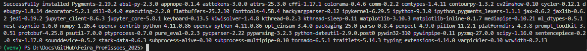
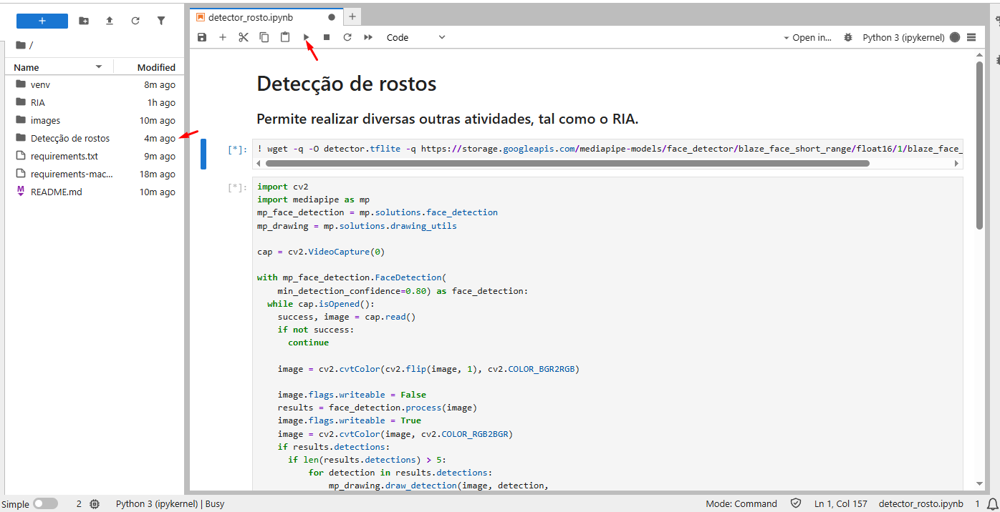

# 🤖 Projeto de IA - Feira de Profissões 2025 

Este projeto contém notebooks Jupyter para tarefas de Inteligência Artificial, como estilização e detecção de rosto em tempo real.

### Sobre o RIA - a IA retratista
A RIA é uma IA especializada em gerar retratos do rosto dos modelos que autorizam a produção. Contudo, a RIA é uma artista incompreendida (nem mesmo ela se compreende) e não salva as artes que produz, por que julga não estarem perfeitas.

Opções para o retrato:
- Digite 1 para utilizar lápis de cor
- Digite 2 para utilizar tinta a base de água
- Digite 3 para utilizar tinta óleo

### Sobre o Detector de Rostos

Ia de detecção de rostos, permite realizar diversas outras atividades, tal como o RIA.


# 🧪 Como testar

## 📁 Requisitos

- [Python 3.11 instalado ](https://www.python.org/downloads/release/python-3110/)
- Câmera (para notebooks que utilizam captura de vídeo em tempo real)

## ⚙️ Configuração do Ambiente

### 1. Criar o ambiente virtual

Abra o terminal (ou PowerShell) na **pasta raiz do projeto** e execute:
#### Windows
```PowerShell
py -3.11 -m venv venv # versão especificada
```

#### Linux/Mac
```Bash
python3.11 -m venv venv # versão especificada
```

### 2. Ativar o ambiente virtual
Ative o ambiente de acordo com o seu sistema operacional:

#### Windows
```PowerShell
venv\Scripts\Activate.ps1
```
⚠️ Se aparecer erro de permissão, execute o PowerShell como Administrador e rode:

```Set-ExecutionPolicy -ExecutionPolicy RemoteSigned -Scope CurrentUser```

Depois tente ativar de novo com:
```PowerShell
venv\Scripts\Activate.ps1
```

#### Linux/Mac
```bash
source venv/bin/activate
```

Você saberá que o ambiente está ativado quando o nome dele aparecer à esquerda no terminal, como por exemplo:

```(venv) PS C:\Local-do-Arquiro\Feira_Profissoes_2025> ```

### 3. Instalar as dependências
Com o ambiente ativado, instale os pacotes necessários:

```
pip install -r requirements.txt
```

Se você estiver utilizando MacOs, rode também:

```
pip install -r requirements-mac.txt
```

A saída esperada após a execução é semelhante a:


## 📓 Executando os notebooks

⚠️ Se ocorrer erros nessa etapa, certifique-se de atender aos requisitos mínimos 
- Python 3.11 instalado
- Câmera (para notebooks que utilizam captura de vídeo em tempo real)

Execute o Jupyter lab (interface mais moderna do Jupyter)
```
jupyter lab
```

Se ocorrer erros relacionado ao Jupyter, tente:
```bash
pip install --upgrade pip setuptools wheel
pip install jupyterlab
```

Isso abrirá seu navegador, onde você pode abrir os notebooks:

- RIA.ipynb
- detector_rosto.ipynb

Seleciona um dos ipynb e execute as células


Para fechar a executação, volte para o terminal e digite
```
ctrl + c
```
